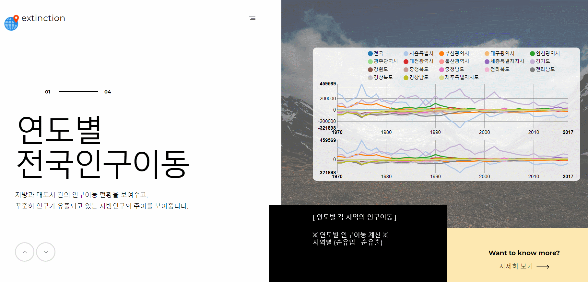

# 프로젝트 개요
- 인구 감소로 인한 지방소멸 위기 지역의 요인분석을 시각화한 프로젝트입니다.
  - 지역별 인구 순유입/순유출 시각화.
  - 지방소멸 지수(인구 감소 또는 증가)가 급격하게 변동한 지역 선정.
  - 선정한 지역의 사회적 이슈와 연관지어 분석.

## 시연 화면

## 사용된 기술
- HTML, CSS, JS
- MVC 모델 기반의 JSP
- R(데이터 정제 및 시각화)

## Reference
- [국가통계포털](http://kosis.kr/index/index.do)